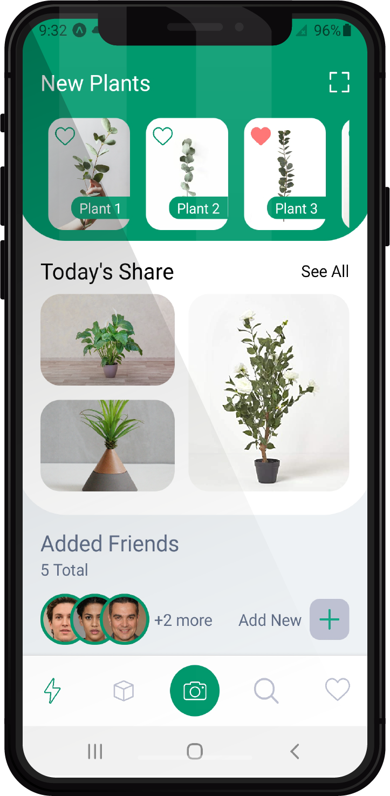
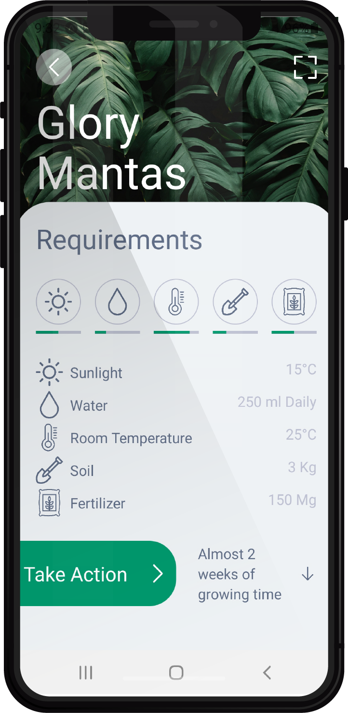

<h1 align="center">
    
</h1>
<h1 align="center">
    
</h1>

<h4 align="center"> 
	Notes App
</h4>

<p align="center">
  

  	
  
  <a href="https://github.com/Oppadayo/plant-exploration-app/commits/master">
    
  </a>

  
   <a href="https://github.com/Oppadayo/plant-exploration-app/stargazers">
    
  </a>
</p>


## 💻 Sobre o projeto

📚 Plants Exploration App - é uma interface de rede social de plantas

-Visualizar a interface e interagir com algumas partes

## 🛠 Tecnologias

As seguintes ferramentas foram usadas na construção do projeto:

- [Javascript]
- [React Native]
- [Expo]

### Pré-requisitos

Antes de começar, você vai precisar ter instalado em sua máquina as seguintes ferramentas:
- Um celular ou emulador com expo 
- Editor de texto (caso queira mexer no código)

### 🧭 Rodando a aplicação

```bash
# Clone este repositório
$ git clone https://github.com/Oppadayo/plant-exploration-app

# Acesse a pasta do projeto no terminal/cmd
$ cd plant-exploration-app

# Instale as dependências
$ npm install

# Inicie o projeto
$ npm start

Uma nova aba irá abrir no browser, use o expo do celular/emulador para ler o QR e rodar o app
``

